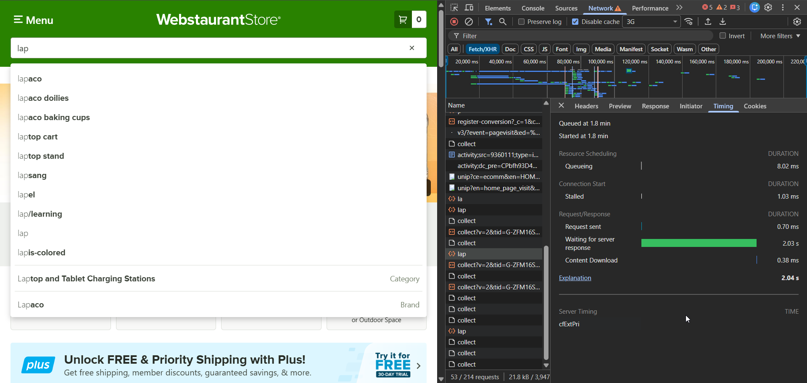

## BR-001: Autocomplete response time exceeds acceptable UX threshold under 3G network conditions

**Severity:** Medium

Severity Justification: Medium severity is justified because the functionality remains operational; however, the autocomplete response time (~2 seconds under 3G conditions) exceeds acceptable UX performance thresholds for interactive search, negatively affecting perceived responsiveness and user experience.

**Priority:** Medium

Severity Justification:
Autocomplete delay does not break core functionality, but it directly impacts the user experience (UX) for interactive search. A noticeable delay (~2 seconds) increases perceived slowness, reduces responsiveness, and may cause users to assume the search is not working. Since the issue degrades usability without blocking functionality, the severity is classified as Medium (S2).

**Status:** Open  
**Component:** Search / Autocomplete  

**Environment:**
- OS: Windows 11  
- Browser: Chrome 121  
- Date: 2026-02-07

---

## Summary
Search autocomplete suggestions load with noticeable delay (~2 seconds) under limited network conditions.

---

## Description
When the user types into the search field under 3G network conditions, autocomplete suggestions take approximately 2 seconds to appear. Timing analysis shows that most of the delay occurs during server response (TTFB), negatively impacting perceived performance and user experience.

---

## Steps to Reproduce
Open https://www.webstaurantstore.com
Open DevTools → Network
Enable “Disable cache”
Set throttling to “Fast 3G”
Type “lap” into the search field
Observe autocomplete response time

---

## Expected Result
Autocomplete suggestions should appear within acceptable UX performance threshold (<500ms recommended for interactive search).

---

## Actual Result
Autocomplete suggestions appear after ~2 seconds.
Timing analysis shows ~2.03s Waiting (TTFB).

---

---

## 🧾 Evidence

### 📡 Network Timing Analysis (3G)

**Observed metrics:**
- **Total:** ~2.04s  
- **Waiting (TTFB):** ~2.03s  
- **Status:** 200 OK  
- **Endpoint:** `/autosuggest/lap`

**Observed metrics:**
- Total: ~2.04s
- Waiting (TTFB): ~2.03s
- Status: 200 OK
- Endpoint: /autosuggest/lap

## Conclusion

The autocomplete search suggestions demonstrate a severe delay (~2.03s TTFB) under throttled 3G conditions.  
This performance issue directly impacts UX quality, slows down user interaction, and violates the recommended UX benchmark of <500ms for responsive search.  

The timing analysis confirms that the bottleneck occurs during the initial server response (TTFB), indicating a backend/API latency issue rather than a frontend rendering delay.  
Fixing this requires backend optimization of `/autosuggest/lap`, improved edge caching, or reduced payload/processing time on the server side.

