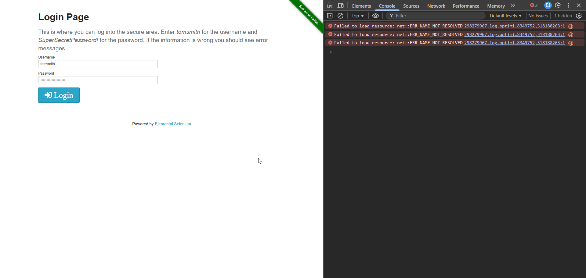
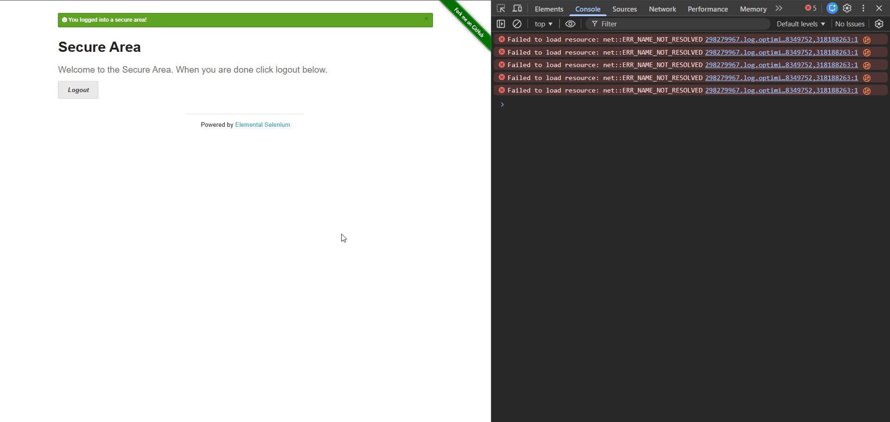
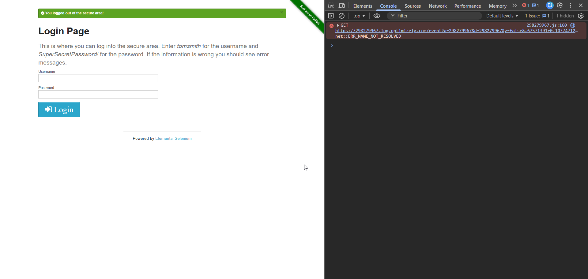
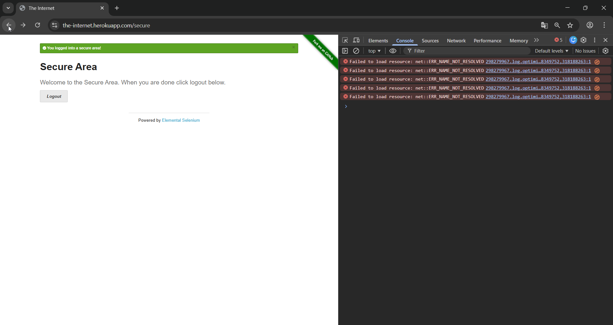

# BR-002 — Secure Page Accessible via Browser Back After Logout

Severity: High  
Severity Justification: High severity because a previously authenticated secure page remains accessible after logout via browser back navigation. This indicates improper session invalidation or missing cache-control headers, potentially exposing sensitive information to unauthorized users.
Status: Open  
Component: UI / Layout  
Environment: Windows 11, Chrome 121

---

## Summary
After logging out, the protected /secure page can still be accessed using the browser Back button without re-authentication.

---

## Description
After logging out from the Secure Area, the protected page remains accessible when navigating back using the browser Back button.
Although access is revoked after a manual page refresh, the previously authenticated content is temporarily displayed from browser cache. This behavior may expose sensitive information to unauthorized users and indicates improper cache control handling (missing or incorrect cache headers).
This behavior indicates improper cache-control implementation and poses a potential security risk by exposing previously authenticated content after session termination.

---

## Steps to Reproduce
1. Open: https://the-internet.herokuapp.com/login
2. Enter valid credentials:
   - Username: tomsmith
   - Password: SuperSecretPassword!
3. Click **Login**.
4. Confirm the "Secure Area" page is displayed with message:
   "You logged into a secure area!"
5. Open **Browser Console (F12)** and observe console errors.
6. Click **Logout**.
7. Click the browser **Back** button.
8. Observe that the "Secure Area" page content is displayed again.
9. Press **Refresh (F5)**.
10. Observe red message:
    "You must login to view the secure area!"

## Expected Result
After logout, protected content must not be accessible.
Using the browser Back button should not display the Secure Area page content.

## Actual Result
After clicking Back, the Secure Area page content is temporarily displayed (likely from browser cache).
After refreshing the page, access is denied and user is redirected to Login Page.

## Evidence

1. Login Page  

2. Credentials Entered  

3. Secure Area After Successful Login  

4. Login Page After Logout  

5. Secure Page Accessible via Browser Back  

