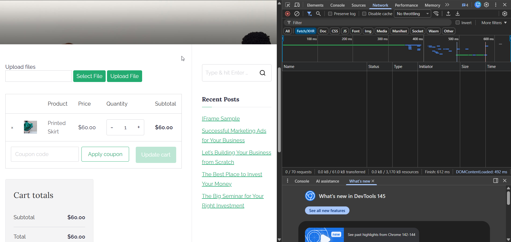

# BR-004 — Cart Quantity Not Updating

**Severity:** High  

**Severity Justification:**  
Changing product quantity directly affects the total amount the customer must pay. If the total price does not update after modifying the quantity, it may lead to incorrect charges, financial loss for the store, and confusion for the user. Since the issue impacts the core checkout flow and can result in incorrect order totals, the severity is classified as **High (S2)**.

**Priority:** High 

Priority Justification: This issue affects the checkout flow and can cause customers to see incorrect total amounts during purchase. Even though the bug does not block the checkout entirely, it creates financial discrepancies and reduces user trust. Since incorrect pricing can directly impact conversions and business revenue, the priority is set to High (P2) to ensure timely resolution.

**Status:** Open  
**Component:** Cart / Checkout

---

## Summary
Changing product quantity does not update the total price.

---

## Description
When the user modifies product quantity in the cart, total price remains the same until page refresh.
This may cause incorrect order totals and financial inconsistencies.

---

## Steps to Reproduce
1. Add any product to cart.
2. Go to the cart.
3. Change quantity from 1 → 2 or 3.
4. Observe the total amount.

---

## Expected Result
Total price recalculates automatically after quantity changes.

---

## Actual Result
Total price remains unchanged until manual page reload.
../Evidence/Screenshots/Raw/BR-004_Cart_Quantity_Not_Updating.png
---

## Evidence

### 1. Cart Page — Total Price Not Updating

### 2. Network Tab — No Recalculation Request

## Conclusion

The cart does not recalculate the total price after modifying product quantity, causing the displayed total to remain outdated until a manual page refresh. This leads to incorrect pricing information and may result in users submitting orders with invalid totals.

This behavior indicates a breakdown in the cart’s reactive update mechanism and suggests missing frontend event handlers or unprocessed backend responses for cart recalculation.

As a result:

- Users see incorrect order totals  
- Financial discrepancies may occur  
- Checkout reliability is reduced  
- Business revenue and customer trust are negatively affected  

To resolve the issue, the cart must dynamically update total pricing whenever quantity changes occur, ensuring accurate real-time calculations and preventing outdated totals from being displayed.
