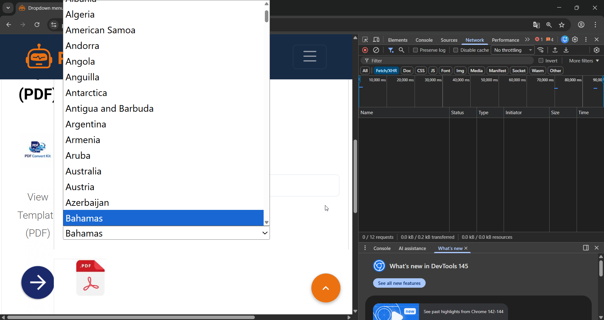

# BR-005 — Dropdown Overlaps Other UI Elements

**Severity:** Low 

**Severity Justification:** The issue is classified as Low severity because it affects only the visual layout and does not block primary user workflows.  
Although the overlap may cause minor confusion or hide interface elements, all core functionality remains fully accessible.  
Therefore, the visual defect impacts UI clarity but does not interrupt user operations.

**Priority:** Low  

Priority Justification:  
Since the issue is purely visual and does not impact functionality or block any user flow, it is categorized as Low (P3). The defect does not affect business logic, revenue, or usability-critical interactions.

**Status:** Open  
**Component:** UI / Layout
**Environment:** 
OS: Windows 11  
Browser: Google Chrome 121  
Date: 2026-02-19  
Device: Laptop (1920x1080)  

---

## Steps to Reproduce
1. Open the Dropdown List page.
2. Locate any form field with a dropdown control.
3. Click the dropdown to expand the list of items.
4. Observe the UI elements underneath the dropdown menu.

## Summary
Dropdown menu overlaps UI elements underneath it, hiding content.

---

## Description
When the dropdown expands, it overlaps underlying UI elements, partially hiding text or buttons behind it.

---

## Actual Result
The dropdown visually overlaps underlying UI elements, partially hiding the content beneath it.

## Expected Result:
Dropdown should not overlap underlying UI elements. Content beneath the dropdown must remain readable.

## Evidence

### 1. UI Overlap Screenshot 

## Conclusion

The dropdown visually overlaps underlying UI elements, partially hiding important content and reducing readability.  
While this issue does not block core functionality, it creates layout inconsistency and may negatively affect user experience, especially when users interact with form elements or buttons located beneath the dropdown.

As a result:

- UI elements become partially unreadable  
- Users may miss important information  
- Overall interface clarity is reduced  
- Visual polish and perceived product quality are negatively impacted  

To resolve the issue, the dropdown should appear above other UI components using proper z-index layering, ensuring that no underlying content is obscured during expansion.

