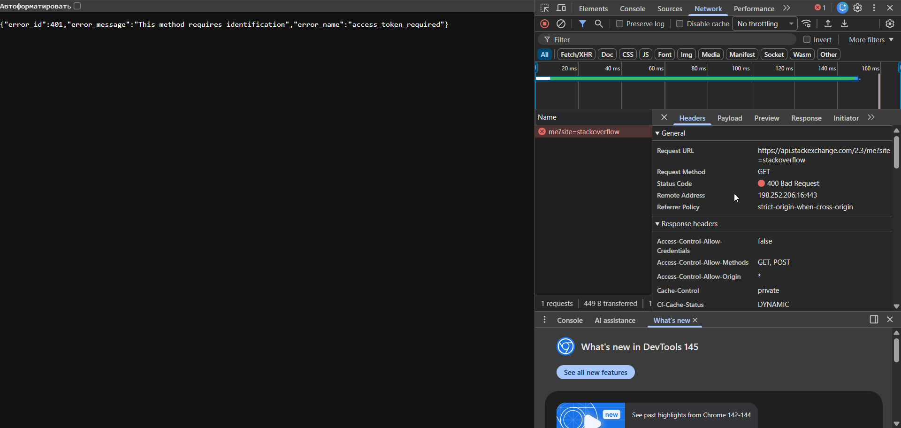
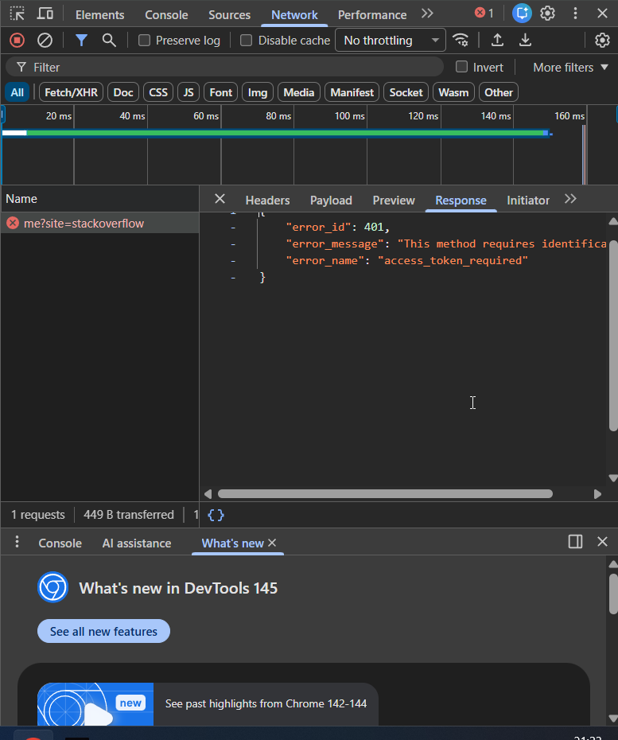

# BR-007 — Profile API Returns 401 for Logged-In User

**Severity:** Critical  
**Severity Justification:** Authenticated users cannot access their profile data; this blocks core account functionality, prevents account management, and may lead to data-access incidents.  
**Priority:** High  
**Status:** Open  
**Component:** API / Authentication  

**Environment:**
- Platform: Web
- Browser: Chrome
- API Host: `https://api.stackexchange.com`
- Endpoint: `GET /2.3/me?site=stackoverflow`
- Tools: Chrome DevTools → Network → Fetch/XHR

---

## Summary
Authenticated user receives an authorization error from the profile API endpoint instead of their profile data.

---

## Description
When requesting the profile endpoint, the API does not return user data, but instead responds with an authorization error.  

The HTTP status is **400 Bad Request**, while the JSON payload contains:

- `error_id: 401`  
- `error_name: "access_token_required"`  
- `error_message: "This method requires identification"`  

This indicates that the endpoint treats the request as **unauthenticated**, even though it is used to retrieve the current user's profile.

---

## Steps to Reproduce

1. Open the web application in Chrome.  
2. Ensure the user session is considered "logged in" in the client (or reproduce from a context where profile data is expected to be available).  
3. Open **Chrome DevTools** → **Network** tab → filter by **Fetch/XHR**.  
4. Trigger loading of the current user profile (or directly navigate to):  
   `https://api.stackexchange.com/2.3/me?site=stackoverflow`  
5. In the Network panel, select the `/me?site=stackoverflow` request.  
6. Inspect the **Status** and **Response**.

---

## Expected Result
- API returns **200 OK**.  
- Response body contains JSON with the authenticated user’s profile data (id, display name, etc.).  

---

## Actual Result
- API returns **400 Bad Request**.  
- Response body contains an authorization error:  
  - `error_id: 401`  
  - `error_name: "access_token_required"`  
  - `error_message: "This method requires identification"`  
- No profile data is returned; the user cannot access their own account information.

---

## Impact Analysis

**User Impact:**
- Authenticated users cannot retrieve or view their own profile data.  
- Profile-related features (settings, personal info, history) cannot be used.  
- Creates confusion and erodes trust, as the system behaves as if the user is not logged in.

**Business Impact:**
- Core account functionality is broken for affected users.  
- Increased support load due to users reporting “logged in, but profile unavailable”.  
- Potential blockers for production release, especially for authentication-sensitive products.

**Technical Impact:**
- Profile endpoint requires an access token but the client request is sent without one or the token is not propagated.  
- Mismatch between client session state and backend authentication state.  
- Error handling returns generic 400 with embedded 401 error, which complicates debugging and monitoring.

---

## Evidence

### Screenshot 01 — Console (JSON error)

### Screenshot 02 — Network Headers (400 Bad Request)

### Screenshot 03 — Network Response (error body)

---

## Conclusion
The profile API endpoint treats requests as unauthenticated (`access_token_required`) and does not return profile data, even when the client expects the user to be logged in.  

This indicates a broken authentication flow for profile retrieval (missing or not forwarded access token). The issue must be resolved before release by:

- Ensuring access tokens are correctly obtained and attached to `/me` requests.  
- Aligning client session state with backend authentication.  
- Verifying that authenticated profile requests consistently return **200 OK** with valid user data.
