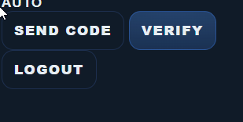

# BR-008: Logout visible for unauthenticated user

## Description
Logout button appears before authentication is completed.

## Environment
Web UI

## Steps to Reproduce
1. Open app
2. Do not log in
3. Observe UI

## Expected Result
Logout hidden

## Actual Result
Logout visible

## Severity / Priority
Severity: Medium  
Priority: High

## Impact on User
Confuses user and breaks trust

## Risk Analysis
Auth issues may expand into security flaws

## Root Cause Hypothesis
Auth state not bound

## Evidence

