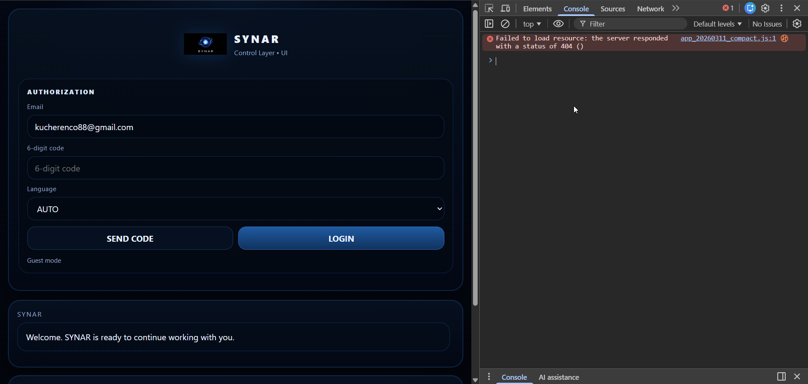

# BR-012: Timing mismatch

## Description
Displayed vs actual latency mismatch

## Environment
UI

## Steps to Reproduce
Measure response

## Expected Result
Accurate

## Actual Result
Mismatch

## Severity / Priority
Severity: Medium  
Priority: Medium

## Impact on User
Misleading UX

## Risk Analysis
Metrics unreliable

## Root Cause Hypothesis
Timer desync

## Evidence

