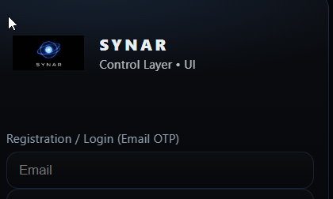
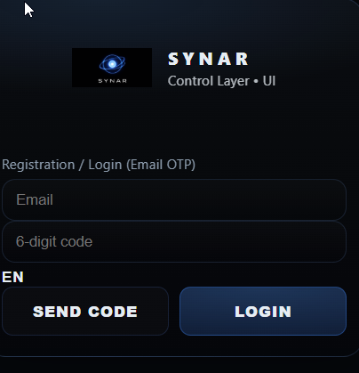

# BR-014: UI language leak

## Description
Unexpected label

## Environment
Frontend

## Steps to Reproduce
Open login

## Expected Result
Clean

## Actual Result
Extra label

## Severity / Priority
Severity: Low  
Priority: Medium

## Impact on User
UI inconsistency

## Risk Analysis
State leak risk

## Root Cause Hypothesis
Language state leak

## Evidence

