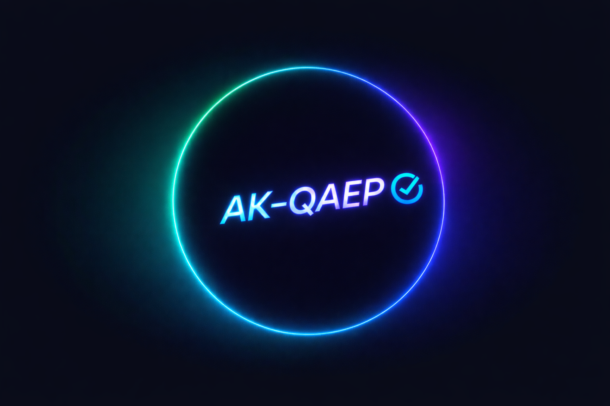

<h1 align="center">Artur Kucherenko — QA Engineer Portfolio</h1>

  

  
  
  
  

---

# 🔗 Quick Navigation

- 🐞 **[Bug Reports](BugReports/)**  
- 🧪 **[Test Cases](Week1/)**  
- 🔌 **[API Testing](API/)**  
- 📂 **[Week 1](Week1/)** — Fundamentals  
- 📂 **[Week 2](Week2/)** — Functional Testing  
- 📂 **[Week 3](Week3/)** — API + HTTP Status  
- 📸 **[Evidence](Evidence/)** — Screenshots, Videos  
- 📄 **[Docs](Docs/)** — Templates & Instructions  

---

# 🧑‍💻 About Me

I am a detail-oriented **Manual QA Engineer** with practical experience in:

- UI/UX & Functional Testing  
- Exploratory Testing  
- API Testing (Postman, DevTools)  
- Bug Reporting (professional format, reproducible steps)  
- Test Case Design  
- HTTP Status Code Analysis  
- DevTools Investigation  
- Validation & Negative Testing  

This portfolio contains real testing artifacts created following QA industry standards.

---

# 📁 Portfolio Structure

### **Week 1 — Web Testing Fundamentals**
- UI/UX testing  
- DevTools basics  
- First bug reports  
- Initial test cases  
- Basic checklists  

### **Week 2 — Functional Testing**
- Negative / boundary testing  
- Input validation  
- Mid-level bug reports  
- Extended test cases  

### **Week 3 — API Testing**
- Postman collections  
- Manual API requests  
- HTTP status research  
- API bug reports  

---

# 🐞 Bug Reports (PDF + Markdown)

All bug reports follow a unified professional format:

- Summary  
- Steps to Reproduce  
- Expected vs Actual  
- Severity / Priority  
- Environment  
- Evidence  

👉 **Full Index:**  
📄 **[BugReports_Index.md](BugReports/BugReports_Index.md)**

👉 **BugReports folder:**  
📁 **[BugReports/](BugReports/)**

Each bug includes both:
- `.md` (for GitHub readability)  
- `.pdf` (for recruiters / HR)  

---

# 🧪 Test Cases

Test cases follow standardized QA documentation style, including:

- Preconditions  
- Steps  
- Expected Results  
- Postconditions  
- Priority  
- Status  

👉 All Test Cases:  
📁 **[Week1/](Week1/)**  
📁 **[Week2/](Week2/)**  
📁 **[Week3/](Week3/)**  

(More sections will be added as the portfolio grows.)

---

# 🔌 API Testing (Postman & DevTools)

API tests include:

- GET / POST / PUT / DELETE requests  
- Positive & Negative tests  
- Authentication flows  
- Edge case validation  
- Manual HTTP experiments  
- Error code research (200, 204, 401, 403, 418, 500, 503...)  

👉 API Folder:  
📁 **[API/](API/)**

---

# 🔧 Tools & Technologies

- **Browsers:** Chrome, Firefox  
- **API:** Postman, DevTools  
- **Documentation:** Markdown, PDF  
- **Version Control:** Git, GitHub  
- **OS:** Windows 11  
- **Other:** ShareX, VS Code, GitLens  

---

# ✉️ Contact

📧 **Email:** kucherenko1988artur1988@gmail.com  

---

Thanks for reviewing my portfolio!

